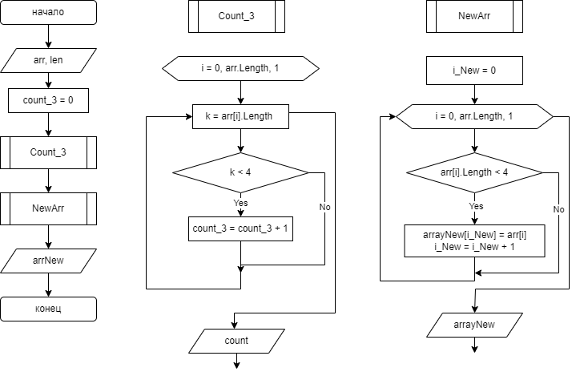

# Решение задачи
## Блок-схема решения задачи ##

## Алгоритм решения задачи ##
1. Ввод с клавиатуры размера исходного массива
2. Ввод с клавиатуры через Enter строковые данные в исходный массив.
3. Вывод элементов исходного массива через пробел в строчку.
4. В методе Count_3 определение количества строковых элементов, длина которых меньше или равна 3.
5. В методе NewArr происходит запись строковых элементов исходного массива в новый массив с длиной , которая была определена в методе Count_3.
6. Вывод элементов нового массива через пробел в строчку.